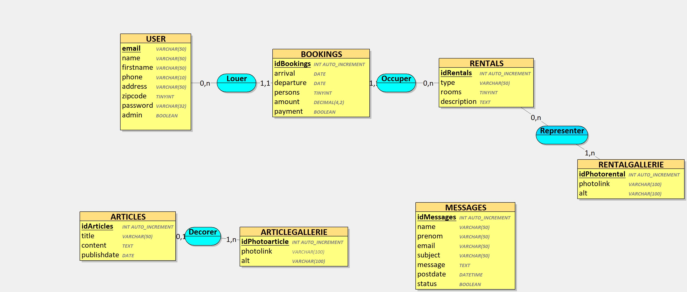

# Locabraz
Projet de soutenance Kercode

## A propos du Projet : 

Locabraz est une entreprise de locations saisonnières dans le Finistère Sud.
Le but de ce site est à terme de proposer un système de réservation propre, tout en étant connecté à AirBnB et Booking.
C'est est un projet qui continuera à vivre après la soutenance, éventuellement sous une autre forme.

### Technologies employées :

J'ai utilisé Looping (https://www.looping-mcd.fr/) pour créer ma base de données.

Voici le schéma conceptuel de celle-ci:



#### Langages :
HTML
CSS
JavaScript
PHP
MySQL

#### Utilitaires
Composer
Looping
VSCode
PHPMyAdmin

## Installation du projet

Lien du repository:
https://github.com/elemouellic/Locabraz.git

En tout premier lieu, via la console, effectuer un git clone

* Git clone
```sh
git clone https://github.com/elemouellic/Locabraz.git
```

* Composer
Installer Composer si vous ne l'avez pas (https://getcomposer.org/download/) puis effectuer en ligne de commande un 

```sh
composer install
```

* .env - 
  
Renommer le fichier .env.example en .env en remplissant les champs adéquats

```
DB_NAME = 'Nom de la base de données'
DB_HOST = 'Adresse de la base données'
DB_PORT = 'Port utilisé'
DB_USERNAME = 'Utilisateur de la base de données'
DB_PASSWORD = 'Mot de passe de la base de données'
SITE_URL = 'URL du serveur ex: http://localhost/Locabraz/'
 ```


## Base de données

La base de données `locabraz.sql` se trouve à la racine du projet. Elle contient les informations nécessaires au fonctionnement de l'application.

Il y a deux utilisateurs enregistrés:


L'administrateur:
```
Login : admin@locabraz.com
MdP : locabraz
```
Un utilisateur avec une réservation:
```
Login : utilisateur@locabraz.com
MdP : locabraz
```
Vous pouvez accéder au dashboard et au compte utilisateur via la rubrique 'Mon Compte'

## Version PC


## Version Mobile


## Contact

Pour toute question concernant l'installation du projet vous pouver me contacter par mail:

```
emmanuel.lm@gmail.com
```

## Remerciements

Je tiens à remercier le Greta de Vannes et tout particulièrement nos deux formateurs dévoués Marie-Christine L. et Thierry B. pour leur aide précieuse et leur bonne humeur.

